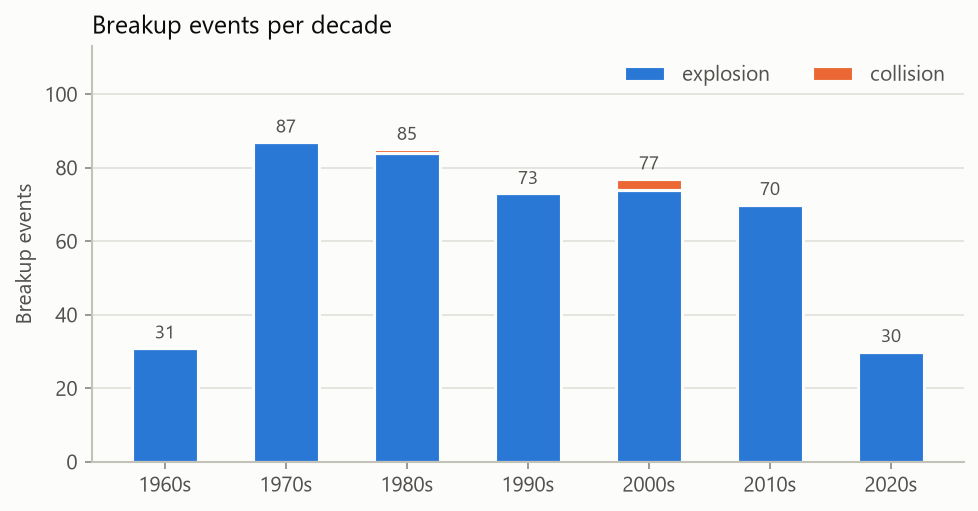
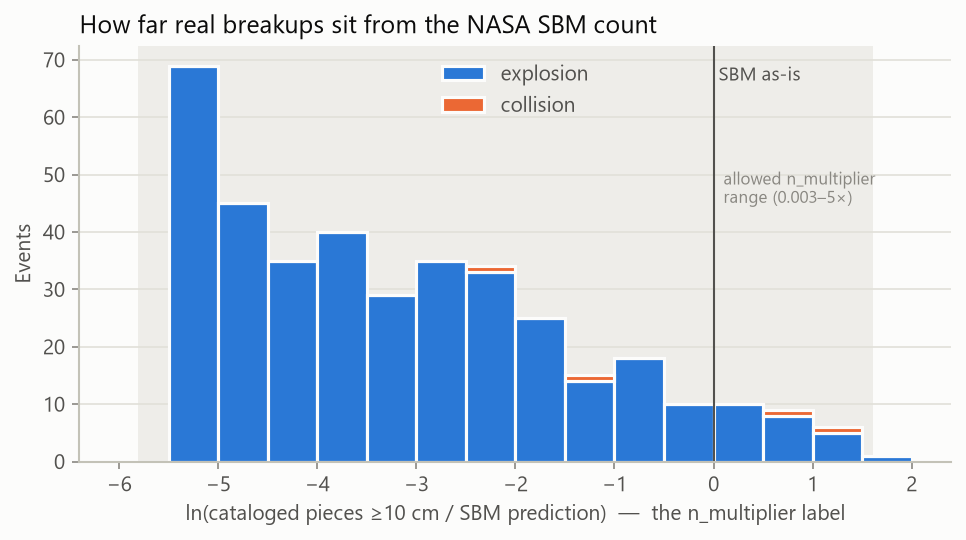
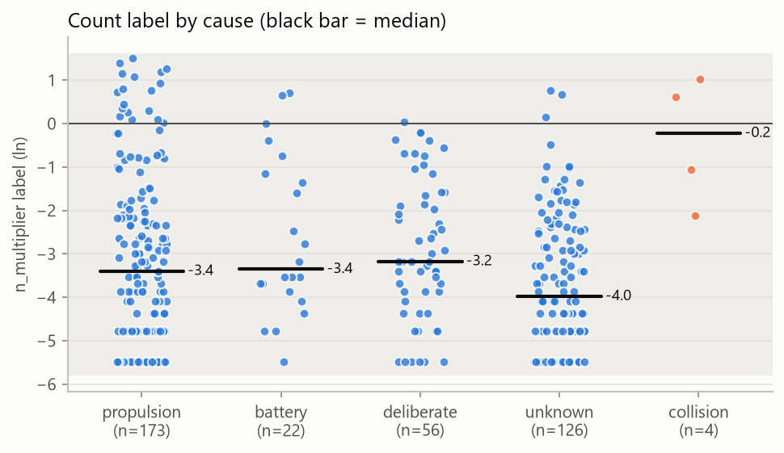
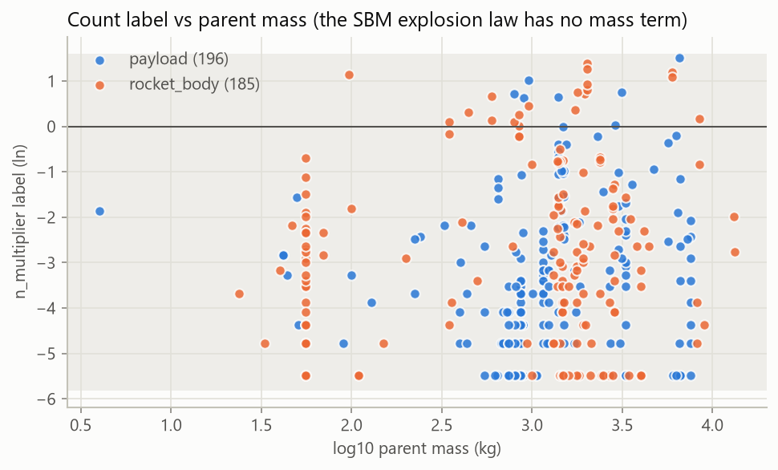

# Training data EDA

As of 2026-10-03, data from `D:\CodeProjects\Satellite-Collision-AI\cloud_predictor\data`. Generated by `python -m pipeline.eda`.

## Summary

- 480 events in the CSV; **453 valid** after joining specs, 27 skipped (see validation.md).
- **381 events carry an `n_multiplier` label** (the fragment-count correction). The other 72 have no label: 42 have an ambiguous count (parent broke up more than once), 29 have zero cataloged pieces, and 1 are under a year old (catalog still filling).
- Explosions: 449, collisions: 4. 116 CV groups.
- Median label **-3.40** (×0.03 of the SBM count); 100% of labels fall inside the allowed n_multiplier range 0.003–5×.

## Events

| event_type | explosion_cause | payload | rocket_body |
| --- | --- | --- | --- |
| collision | — | 4 | 0 |
| explosion | battery | 32 | 0 |
| explosion | deliberate | 57 | 1 |
| explosion | propulsion | 13 | 188 |
| explosion | unknown | 132 | 26 |

## Spec field coverage

Share of valid events whose parent record has the field. Missing values are imputed by the model (the neural net heads carry missing indicators and a missing bucket per categorical); a parent with no construction info at all (material, panels, volume, MLI, bus family) gets the neutral fallback band.

| field | coverage |
| --- | --- |
| dry_mass_kg | 100% |
| propellant_mass_kg | 0% |
| structure_material | 0% |
| solar_array_area_m2 | 0% |
| bus_volume_m3 | 89% |
| mli_fraction | 0% |
| launch_year | 100% |
| bus_family | 100% |

## Fragment-count label (`n_multiplier`)

Label = ln(cataloged pieces ≥10 cm / NASA SBM N(≥10 cm)). 0 means the SBM is right; the grey band is the range the estimator clips predictions to (`ml.contract.BOUNDS`).

| event_type | cause | n | median | p10 | p90 |
| --- | --- | --- | --- | --- | --- |
| collision | — | 4 | -0.22 | -1.80 | 0.90 |
| explosion | battery | 22 | -3.35 | -4.74 | -0.05 |
| explosion | deliberate | 56 | -3.17 | -5.13 | -0.61 |
| explosion | propulsion | 173 | -3.40 | -5.48 | -0.02 |
| explosion | unknown | 126 | -3.98 | -5.48 | -1.55 |

Correlation of the label with log10 parent mass: **+0.17**. The SBM explosion law (N = 6·S·Lc^-1.6, S = 1 for every event here) ignores mass, so any trend here is signal the model can learn.

Most extreme labels:

| event_id | year | event_type | explosion_cause | object_class | total_mass_kg | n_cataloged | n_sbm | label |
| --- | --- | --- | --- | --- | --- | --- | --- | --- |
| discos-526 | 2017 | explosion | propulsion | payload | 2763.0 | 1.0 | 238.9 | -5.5 |
| discos-646 | 2018 | explosion | propulsion | rocket_body | 1000.0 | 1.0 | 238.9 | -5.5 |
| discos-289 | 2016 | explosion | propulsion | rocket_body | 56.0 | 1.0 | 238.9 | -5.5 |
| discos-819 | 1968 | explosion | unknown | payload | 800.0 | 1.0 | 238.9 | -5.5 |
| discos-846 | 1970 | explosion | unknown | payload | 892.0 | 1.0 | 238.9 | -5.5 |
| discos-285 | 2015 | explosion | propulsion | rocket_body | 1600.0 | 1.0 | 238.9 | -5.5 |
| discos-130 | 1982 | explosion | unknown | payload | 3300.0 | 1.0 | 238.9 | -5.5 |
| discos-49 | 1993 | explosion | deliberate | payload | 6300.0 | 1.0 | 238.9 | -5.5 |
| discos-15 | 1988 | explosion | deliberate | payload | 6640.2 | 1.0 | 238.9 | -5.5 |
| discos-66 | 1968 | explosion | deliberate | payload | 2477.7 | 1.0 | 238.9 | -5.5 |

## Collisions

EMR = impactor kinetic energy / target mass; ≥ 40 J/g is catastrophic.

| event_id | year | total_mass_kg | emr_j_per_g | is_catastrophic | n_cataloged | n_sbm | label |
| --- | --- | --- | --- | --- | --- | --- | --- |
| discos-111 | 1985 | 875.0 | 359.1 | True | 288.0 | 835.0 | -1.1 |
| discos-182 | 2007 | 958.0 | 25365.3 | True | 3536.0 | 1271.8 | 1.0 |
| discos-217 | 2008 | 1820.0 | 527.7 | True | 174.0 | 1440.8 | -2.1 |
| discos-224 | 2009 | 900.0 | 50345.1 | True | 2375.0 | 1274.3 | 0.6 |

## DISCOS event selection

673 DISCOS fragmentation events; 480 kept as structural breakups.

| discos_event_type | excluded | kept |
| --- | --- | --- |
| Unknown | 0 | 113 |
| Proton Ullage Motor | 0 | 57 |
| Propulsion | 1 | 50 |
| Ariane Upper Stage | 0 | 30 |
| Cosmos 699 Class (EORSAT) | 0 | 29 |
| Cosmos 862 Class (Explosive Charge) | 0 | 22 |
| DMSP/NOAA Class | 0 | 18 |
| Small Impactor | 0 | 17 |
| Delta Upper Stage | 0 | 15 |
| Meteor Class | 0 | 15 |
| ASAT | 0 | 15 |
| Battery | 0 | 13 |
| Payload Recovery Failure | 0 | 10 |
| Deliberate | 0 | 9 |
| H-IIA Class | 0 | 9 |
| Cosmos 2031 Class | 0 | 8 |
| Zenit-2 Upper Stage | 3 | 8 |
| Briz-M | 0 | 7 |
| Tsyklon Upper Stage | 0 | 7 |
| Collision | 0 | 6 |
| Delta 4 Class | 0 | 5 |
| Scout Class | 0 | 4 |
| CZ-6A Upper Stage | 0 | 4 |
| Titan Transtage | 0 | 4 |
| Accidental | 0 | 3 |
| Cosmos-3 Class | 0 | 1 |
| Electrical | 0 | 1 |
| Aerodynamics | 32 | 0 |
| Anomalous | 65 | 0 |
| ERS/SPOT Class | 9 | 0 |
| RORSAT Reactor Core Ejection Class | 17 | 0 |
| L-14B Class | 19 | 0 |
| Transit Class | 23 | 0 |
| TOPAZ Leakage Class | 2 | 0 |
| Unconfirmed | 15 | 0 |
| Vostok Class | 7 | 0 |

Count cross-check: for 433 single-event parents, the DISCOS fragment count agrees with the SATCAT debris count on the same launch designator (within 10% or 2 pieces) for **81%**. Disagreements usually mean another object on the same launch also shed debris.

| event_id | parent_name | n_cataloged | n_debris_satcat_prefix |
| --- | --- | --- | --- |
| discos-517 | Fengyun 1C debris | 12 | 3534 |
| discos-1037 | Intelsat 33e (IS-33e) | 1086 | 37 |
| discos-1054 | Centaur-5 SEC (Atlas V 541) | 843 | 0 |
| discos-653 | Centaur-5 SEC (Atlas V 551) | 962 | 214 |
| discos-651 | Centaur-5 SEC (Atlas V 401) | 605 | 1 |
| discos-647 | Centaur-5 SEC (Atlas V 401) | 533 | 109 |
| discos-200 | Zi Yuan 1 | 90 | 433 |
| discos-655 | H-II LE-5B (H-IIA 202) | 0 | 132 |

Launches with ≥ 50 cataloged debris pieces but no DISCOS event (likely mission-related objects or breakups DISCOS files under another launch):

| launch | debris_pieces | objects_on_launch |
| --- | --- | --- |
| 1986-017 | 323 | MIR, SL-13 R/B, GFZ 1 |
| 1965-027 | 208 | OPS 4682 (SNAPSHOT), SECOR 4 (EGRS 4) |
| 1982-033 | 197 | SALYUT 7, SL-13 R/B, ISKRA 2 |
| 1963-014 | 148 | MIDAS 6 (FTV 1169), ERS 5, DASH 1 |
| 1998-067 | 146 | ISS (ZARYA), SL-13 R/B, RADIOSCAF-B (KEDR) |
| 1977-097 | 104 | SALYUT 6, SL-13 R/B |
| 2026-051 | 62 | YAOGAN-50 02, CZ-6A R/B |

## Spec sources

- `mass_source`: DISCOS 456, none 2
- `bus_family_source`: name 227, Gunter configuration 116, Gunter page 115
- `volume_source`: DISCOS shape 410, none 48
- Gunter page found for 231 of 238 payload parents.
- Dropped parents: 2 (13387 Cosmos-1306 fragmentation debris: no mass from any source; 29957 Fengyun 1C debris: no mass from any source)

## Assumptions to keep in mind

- DISCOS `mass` is used as dry mass and propellant as 0 unless overridden; most breakups happen after propellant is spent, but propulsion explosions of stages with residual propellant are understated.
- `n_cataloged` counts every piece ever cataloged (decayed included). Pieces that decayed before they could be cataloged are missing, so short-lived low-altitude clouds read low.
- Events DISCOS classes as anomalous shedding, re-entry break-up, coolant release, or unconfirmed are excluded (see `pipeline/build_events.py: EVENT_TYPE_MAP`).
- Collision rows need impactor mass and v_rel from `data/manual/collisions.csv`; rows without them are skipped in training.
